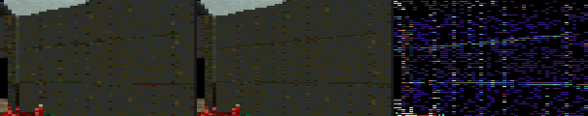

# Virtual Jaguar libretro — Atari Jaguar & Jaguar CD emulator core

**Virtual Jaguar libretro** is an open-source **Atari Jaguar emulator** — cartridges *and* **Jaguar CD** — packaged as a **libretro core**, so it runs everywhere **RetroArch** runs.

All four Jaguar processors are emulated (68000, GPU, DSP, Object Processor), plus the CD drive's BUTCH controller, the link port, the Memory Track cartridge, the Jaguar GameDrive, and the controller-port peripherals — ST/Amiga mouse, Tempest rotary, analog and driving controllers, and the light gun. CI builds 16 platforms on every release tag. Every accuracy, performance and compatibility claim below links to the commit, pull request, test log or committed document behind it.

[](https://github.com/libretro/virtualjaguar-libretro/actions/workflows/c-cpp.yml)
[](https://github.com/libretro/virtualjaguar-libretro/releases)
[](LICENSE)
[](.github/workflows/release.yml)


<sub>Cybermorph, frame 850. Stock / true-color / difference. The difference panel is amplified **64×** on purpose — the per-pixel delta is deliberately subtle. Details and numbers in [Enhancements](#enhancements).</sub>

---

## What makes this core different

### Everything RetroArch does, you get for free

This is a libretro core, so the whole frontend feature set applies — and the core does the work required to make the harder ones actually function:

| Frontend feature | What the core does to support it |
| --- | --- |
| **RetroAchievements** | Exposes libretro memory maps and asserts achievement support; a harness checks the rcheevos Atari Jaguar console mapping resolves against this core's RAM ([`test_memory_map.c`](test/tools/test_memory_map.c), [`test_rcheevos_e2e.sh`](test/tools/test_rcheevos_e2e.sh)) |
| **Run-ahead, rewind, netplay** | Declares deterministic savestates, backed by a harness that reproduces RetroArch's rollback loop and demands byte-identical replay ([PR #327](https://github.com/libretro/virtualjaguar-libretro/pull/327), [`test_runahead_determinism.c`](test/tools/test_runahead_determinism.c)) |
| **Save states that keep working** | Every savestate format any released version of this core ever wrote still loads — versions 1 through 8, with the one documented exception that v1 predates four DAC fields and restores them to defaults ([`savestate-compat.md`](docs/savestate-compat.md)) |
| **Shaders, overrides, remapping, fast-forward, screenshots, streaming** | Clean XRGB8888 video and 48 kHz stereo audio out of [`libretro.c`](libretro.c); RetroArch does the rest |
| **Cheats** | Native cheat-code decoding, covered by the test suite |

### And the Jaguar-specific parts

- **Jaguar CD, two ways.** CUE/BIN and CDI images boot through a high-level-emulated CD BIOS *or* through the real CD BIOS driving emulated BUTCH/DSA/FIFO hardware. Audio CDs play and the Virtual Light Machine visualizer works. ([v3.0.0 notes](docs/RELEASE_NOTES_v3.0.0.md) · [v3.1.0 notes](docs/RELEASE_NOTES_v3.1.0.md))
- **Damaged-rip repair.** CDI images from the old V2 ripper that lost each track's leading bytes used to be rejected outright. The loader now classifies the boot track and repairs slides or head-loss at read time; when bytes are provably gone it logs a precise diagnosis instead of a black screen. ([PR #342](https://github.com/libretro/virtualjaguar-libretro/pull/342))
- **JagLink / netlink link-cable networking.** The Jaguar's link-port serial hardware is emulated at the register level with a TCP transport and a multi-peer hub — Doom deathmatch over LAN validated end to end. ([user guide](docs/netlink-user-guide.md) · [design doc](docs/netlink-design.md))
- **Controller-port peripherals, not just the pad.** The ST/Amiga mouse adapter sold by AtariAge and The Brewing Academy (and its PS/2 variant), emulated from a sourced pin-level mapping including the fact that the real adapter is *row-blind* — all three wiring cases ship as selectable devices. Plus the Tempest 2000 rotary, Atari's TR10 bank-switching analog and driving controllers, the port-1 light gun, and the early-board motherboard ADC at `$F17C00` that BattleSphere's analog stick actually reads — with per-axis dead zone, offset and response curves on every analog source. Every Jaguar controller Atari shipped is now emulated too: the **Team Tap** 4-player adapter (validated through the real bus against AtariJaguarPadtest), the **Pro Controller** six-button pad, and — best-effort, unvalidated against any known software — the **6D flight stick**'s six degrees of freedom. Every one is opt-in: with none selected the controller registers are bit-identical to before, proven by a test. ([user guide](docs/input-devices-user-guide.md) · [mouse mapping](docs/jaguar-mouse-adapter-mapping.md) · [light gun design](docs/lightgun-design.md) · [epic #428](https://github.com/libretro/virtualjaguar-libretro/issues/428))
- **The Jaguar Voice Modem.** Ultra Vortek's modem netplay works — dial, answer and play a match — with the modem's command set derived from the game's own ROM rather than guessed. ([`voice-modem.md`](docs/voice-modem.md) · [#481](https://github.com/libretro/virtualjaguar-libretro/issues/481))
- **Jaguar GameDrive (JagGD).** Detection plus full 16 MB bank switching (6×1 MB pages over 16 banks), implemented from RetroHQ's published GDBIOS bindings, so GD-locked homebrew boots. ([interface notes](docs/jgd-interface-notes.md) · v3.1.0 #312, #320)
- **Memory Track saves.** The Jaguar CD's Memory Track cartridge is emulated — a flash window at `$900000` plus an HLE'd NVM BIOS module — so CD titles keep their saves, round-tripping through the frontend's `.srm`. ([`memory-track.md`](docs/memory-track.md) · [PR #259](https://github.com/libretro/virtualjaguar-libretro/pull/259))
- **A crash watchdog that names the bug.** A runtime watchdog recognises hang and crash signatures (GPU/DSP program-counter escape, wedges, video stalls, CD seek wedges) and writes the diagnosis into your frontend log at the moment of failure — so a bug report points at the subsystem, not just "black screen". ([`crash_detect.c`](src/core/crash_detect.c))
- **No BIOS files required.** The console boot ROM and both Jaguar CD BIOSes ship inside the core. See [BIOS](#bios).
- **Hardware-referenced accuracy.** Emulation decisions are checked against the Jaguar Technical Reference Manual, and an "acid" suite of hardware-behaviour assertions gates CI ([`test/acid`](test/acid)). A distilled, machine-readable JTRM summary is committed as [`docs/jtrm-*.md`](docs).

### One comparative claim

We know of no other Atari Jaguar emulator offering a true-color rendering mode or an internal-resolution upscaling track like the ones described below. If we're wrong, we'd genuinely like to know — [tell us in Discussions](https://github.com/libretro/virtualjaguar-libretro/discussions) and this file gets corrected. We make no other claims about any other emulator's internals.

---

## Enhancements

Features the original hardware never had, built so the stock pipeline stays bit-identical when they're off — and measured, not just screenshotted, when they're on. Every one is a core option you set in your frontend's core-options menu.

### True-color rendering

The Jaguar's blitter computes Gouraud-shaded intensity with **16 fraction bits** of precision, then throws them away writing a 16-bit CRY pixel. The true-color shadow framebuffer keeps them: with `virtualjaguar_true_color = enabled`, shaded pixels are *also* stored at full precision (CRY chroma × 24-bit intensity) in a shadow buffer, and the scanline renderer substitutes them at output time. Game-visible RAM stays bit-identical — the game cannot tell the difference.

Measured on Cybermorph, both blitter engines agreeing exactly ([PR #341](https://github.com/libretro/virtualjaguar-libretro/pull/341) validation record):

| Measurement | Result |
| --- | --- |
| Unique on-screen colors | 304 → **450** (peak frame 423 → 702) |
| Pixels refined | **45.9%**, every changed channel moving by *exactly one* quantization step |
| Difference panel above | amplified **64×** — the per-pixel delta is deliberately subtle |
| Identity with the option off | 600 frames across three cartridge titles hash bit-identical to develop |
| Cost | CRY 16bpp only, default off, ~8 MB allocated only when enabled |

Honest caveat: **Checkered Flag shows no change** — it turns out to be flat-shaded and never uses blitter Gouraud at all. This is banding removal on shaded geometry, not a filter repainting the image, so titles that don't shade don't move.

Design doc: [`docs/true-color-shadowfb-design.md`](docs/true-color-shadowfb-design.md). Status: **shipped in [v3.2.0](docs/RELEASE_NOTES_v3.2.0.md)** (PR #341).

### Overclocking that doesn't distort pacing

Two independent clock-scale options — the 68000 (`virtualjaguar_m68k_clock_scale`, 0.5×–3×) and the RISC GPU/DSP pair (`virtualjaguar_risc_clock_scale`, 0.5×–2×) — for framerate-limited titles. Bus and DRAM latencies are charged in wall time under any clock scale (the cycle-domain contract), defaults are bit-identical to previous behaviour, and audio pitch is proven unchanged at every scale by CI rows running at non-1× scales. ([v3.1.0 notes](docs/RELEASE_NOTES_v3.1.0.md) #314, #316 · [issue #318](https://github.com/libretro/virtualjaguar-libretro/issues/318) via [PR #337](https://github.com/libretro/virtualjaguar-libretro/pull/337))

### CD read-speed control

`virtualjaguar_cd_read_speed`: 1× (hardware-faithful) through 2×/4×/8× up to instant, trimming load screens on the HLE CD path. Implemented with streaming reads so accelerated transfers can't overwrite in-flight game code — the failure mode instant reads used to cause is documented, fixed and regression-tested. ([`docs/cd-read-speed.md`](docs/cd-read-speed.md))

### Crash watchdog

`virtualjaguar_crash_detect` (on by default) checks once per frame for known failure signatures and writes the diagnosis into the frontend log. Cost when enabled: one indirect call plus a ~256-pixel hash per frame. ([`src/core/crash_detect.c`](src/core/crash_detect.c))

### Per-title enhancement defaults

`virtualjaguar_pertitle_defaults` (on by default) applies known-safe enhancement presets automatically for recognized games — only for options you've left at their default value. Any option you've changed yourself always wins, and disabling this option restores stock behaviour for every title. 21 entries (romhack aliases included — **JagDoomEX** is recognized by both patched CRCs and enhanced identically to retail Doom), derived from committed census evidence, including **Alien vs Predator** (2x internal resolution + true color), **Doom** (2x + true color), **Missile Command 3D** (2x + true color), **Hover Strike** (2x), and **Cybermorph** (true color). New entries require committed evidence — propose candidates via [issue #368](https://github.com/libretro/virtualjaguar-libretro/issues/368).

### Internal resolution 2× — real supersampling, complete as of v3.3.0

`virtualjaguar_internal_resolution` (`1x` default, `2x`; restart required) renders above native resolution *inside the core* — and the extra pixels are **source data the hardware sampled past**, not interpolation or a filter. The blitter walks textures with 16.16 fixed-point steps and rounds each output pixel to one texel; at 2× those same walks are re-sampled at double density into a shadow surface. The emulated machine never sees it: the stock framebuffer stays bit-identical and 1×-vs-2× savestate digests match, both proven per-title by committed tooling ([`hires_state_digest`](test/tools/hires_state_digest.c)).

As of [v3.3.0](docs/RELEASE_NOTES_v3.3.0.md) the pipeline is complete across every path that carries recoverable detail:

| Piece | What it supersamples | Shipped |
| --- | --- | --- |
| Stage 2 | fractional-walk **blits** (3D texture walks) | v3.2.0 |
| Stage 3 | Object Processor **scaled sprites** (SCBITOBJ) | v3.3.0 |
| Stage 3 CLUT | scaled **8bpp CLUT** objects — 76–81% of scaled pixels in 2D titles | v3.3.0 |
| RGB16 renderer | delivery for **RGB16 direct** video mode (previously CRY-only) | v3.3.0 |



<sub>JagDoomEX (the per-title database recognizes both patched CRCs and applies Doom's 2×+true-color preset), demo frame machine-selected for peak sub-pixel density: 1× / 2× / difference **amplified 8×**. 14.7% of the frame's pixels change; the diagonal mortar seam resolves continuously at 2×.</sub>

Measured coverage in real scenes: Alien vs Predator 13–31%, Doom 8.7–13.9%, Val d'Isère Skiing **0% → 2.5–7.2%** (its content is scaled 8bpp CLUT in RGB16 mode — both v3.3.0 pieces are load-bearing), Missile Command 3D 5–6%. Titles that magnify their textures (Towers II, I-War) measure a true zero — there is nothing to recover, and the page says so. Full evidence with A/B figures: [jaguar.provenance-emu.com/enhancements](https://jaguar.provenance-emu.com/enhancements.html). Epic [#338](https://github.com/libretro/virtualjaguar-libretro/issues/338).

### Blit memoization

`virtualjaguar_blit_memo` (default off, per-title via the enhancement database) skips blits whose *entire* input state provably matches an earlier identical blit — some titles re-render an identical scene every engine cycle while idle. Output is bit-identical by construction; a verify mode executes every would-be skip and checks it. 2,546,482 corpus verifications, zero divergences. ([`docs/blit-memo.md`](docs/blit-memo.md) · [#411](https://github.com/libretro/virtualjaguar-libretro/issues/411))

---

## Compatibility

### Jaguar CD boot matrix

Generated by [`test/tools/cd_boot_matrix.sh`](test/tools/cd_boot_matrix.sh) into [`docs/cd-boot-matrix.md`](docs/cd-boot-matrix.md) — not typed in by hand. Every image is exercised in **both** CD modes: HLE (high-level-emulated CD BIOS) and BIOS (the real CD BIOS driving emulated BUTCH/DSA/FIFO hardware).

| Measured from the committed matrix | Count |
| --- | --- |
| Disc images in the corpus | **11** |
| Reach game code in HLE mode | **11** |
| Reach game code in real-BIOS mode | **11** |

Titles in the current corpus, all recorded `GAME_CODE` in both modes: Baldies (CUE and CDI), Battle Morph, BrainDead 13, Dragon's Lair, Highlander, Hover Strike — Unconquered Lands, Iron Soldier 2, Myst, Primal Rage, Space Ace.

**Read this honestly.** "Reaches game code" means the 68000 was observed executing game-owned code in RAM with a healthy, non-looping PC trace — a headless regression gate, **not** a completed-the-game certificate. Rows are *disc images*, not distinct games (`baldies.cdi` and `Baldies (USA) (Rev 1).cue` are the same title from two rips). Several rows also record a `cd_seek_wedge` or `video_stall` watchdog signature alongside a passing trace; those are frequently benign (Myst fires one during the intro movie's ~6 s all-black pause while the movie plays from RAM) — the stage column, not the watchdog column, is the gate, and the matrix doc discusses each case. Runs are on the maintainer's own images at the build stamp recorded in the matrix, so your dump may differ.

### Cartridges

Cartridge titles have no equivalent committed per-title matrix yet. Named, verified fixes and open known issues are tracked in [`docs/cart-issue-triage.md`](docs/cart-issue-triage.md) and the release notes; the CD backlog lives in [`docs/cd-known-issues.md`](docs/cd-known-issues.md). Open, tracked examples: Doom combat pacing still runs fast ([#313](https://github.com/libretro/virtualjaguar-libretro/issues/313)), Battle Morph runs fast ([#331](https://github.com/libretro/virtualjaguar-libretro/issues/331)), Battle Sphere menu text renders dark.

libretro also hosts a community-maintained **[Atari Jaguar compatibility list](https://docs.libretro.com/library/compatibility/jaguar/)** — a separate document from the machine-generated boot matrix above, with different methodology and a wider scope.

**If a title works (or doesn't) for you, a report in [Discussions](https://github.com/libretro/virtualjaguar-libretro/discussions) is genuinely useful.** Attach your frontend log: the crash watchdog writes the failure signature at the moment things break.

---

## Quick start

1. **Install the core.** In RetroArch: *Main Menu → Online Updater → Core Downloader → Atari - Jaguar (Virtual Jaguar)*. Or download a build from [Releases](https://github.com/libretro/virtualjaguar-libretro/releases) and drop it in your `cores` folder.
2. **No BIOS files needed.** Nothing to hunt down — see [BIOS](#bios).
3. **Load a game.** Supported: `.j64`, `.jag`, `.rom`, `.abs`, `.cof`, `.bin`, `.prg` (including inside ZIP archives), plus `.cue`, `.cdi`, and `.chd` for Jaguar CD images, and conservative headerless raw homebrew loading. CHD files must include session metadata from a current chdman; see [`docs/jagcd-chd.md`](docs/jagcd-chd.md).

### Core options worth knowing

| Option | Why you'd touch it |
| --- | --- |
| `virtualjaguar_usefastblitter` | Fast vs. accurate blitter. The accurate path is SIMD-accelerated (SSE2/NEON); a few titles still prefer fast |
| `virtualjaguar_true_color` | Full-precision Gouraud shading (see [Enhancements](#enhancements)); default off |
| `virtualjaguar_cd_boot_mode` | HLE CD BIOS (default) vs. real CD BIOS. Audio-only discs need `Auto`/`Real BIOS` |
| `virtualjaguar_cd_read_speed` | Trim CD load screens |
| `virtualjaguar_m68k_clock_scale` / `virtualjaguar_risc_clock_scale` | Overclock a framerate-limited title |
| `virtualjaguar_pal` | NTSC (320×240) vs. PAL (320×256) |
| `virtualjaguar_crash_detect` | Leave on — it's what makes your bug report actionable |
| `virtualjaguar_alt_inputs`, `virtualjaguar_p*_*` | 2-player input and full numpad remapping |

The canonical, always-current list is the [core options reference](https://docs.libretro.com/library/virtual_jaguar/#core-options) on docs.libretro.com.

### Where saves live

Cartridge EEPROM/SRAM and the Jaguar CD Memory Track both go through the libretro SRAM interface, so RetroArch writes them to its **`saves` folder as `<gamename>.srm`**; save states land in the **`states` folder**. Nothing is written next to your ROMs.

---

## BIOS

**No BIOS files are required.** Both Jaguar console boot ROMs (Series K and Model M) and both Jaguar CD BIOSes (retail and developer) are embedded in the core, so every boot mode works out of the box. External images are supported as an *override* for people who want a specific revision — never as a requirement.

- **Cartridges** — `BIOS (Cartridges)` chooses between the HLE BIOS (default: the core performs the boot setup itself, skipping the boot animation) and the real boot ROM. The HLE BIOS reproduces hardware-equivalent post-boot state — MEMCON1, clocks, GPU auth magic, OLP, video-interrupt compare, exception vectors, TOM/JERRY timing — pinned by 219 checks in `test_hle_bios` across NTSC and PAL. GPU-only / jagcrypt carts (the BootIntro demos) auto-enable the real boot ROM even when this is set to HLE, because they contain no 68K program for the HLE path to start.
- **CD discs** — `CD Boot Mode` chooses between the HLE CD BIOS (default, recommended) and a real CD BIOS (`Real BIOS`, or `Auto`, which currently also boots the real BIOS). This *overrides* the cartridge setting for CD content. If a real-BIOS mode is selected but no CD BIOS can be staged at all, the core falls back to HLE rather than failing.

### Which boot ROM a cartridge uses

`Cart BIOS Type` (restart required) picks the console boot ROM for the real-BIOS cartridge path:

| Setting | Image |
| --- | --- |
| `Series K` (default) | The original Jaguar boot ROM. Embedded. |
| `Model M` | The later revision (patch address `$4804`) most size-coded BootIntros target. Embedded, but an optional `jagboot_m.rom` in the `system` directory root replaces it. |
| `Custom` | A 128 KB image loaded from the `system` directory — see below. |

For `Custom`, the core searches these names, in this order, across `system/`, `system/Atari - Jaguar/` and `system/jaguar/`:

`jagboot.rom` · `boot.rom` · `boot0.rom` · `[BIOS] Atari Jaguar (World).j64` · `[BIOS] Atari Jaguar Stubulator '94 (World).j64` · `[BIOS] Atari Jaguar Stubulator '93 (World).j64`

**Filename priority beats directory depth** — a `jagboot.rom` two folders down wins over a `boot0.rom` in the root, because the filename is your explicit signal about which image you meant. If `Custom` is selected and nothing usable is found, the core logs a warning and falls back to the embedded Series K.

### Optional external CD BIOS override

In the real-BIOS CD modes only (`CD Boot Mode` = `Real BIOS` or `Auto`), a CD BIOS file in the `system` directory takes precedence over the embedded images. It must be exactly 256 KiB, and can sit in `system/` or in an `Atari - Jaguar/`, `Atari - Jaguar CD/`, `jaguar/` or `jaguarcd/` sub-folder, under one of these names:

| Type | Accepted filenames |
| --- | --- |
| Retail | `[BIOS] Atari Jaguar CD (World).j64` / `.rom` / `.bin` |
| Developer | `[BIOS] Atari Jaguar Developer CD (World).j64` / `.rom` / `.bin` |
| Generic | `jaguarcd_bios.bin`, `jagcd_bios.bin`, `jaguarcd.bin`, `jagcd.bin`, `Jaguar CD BIOS.rom`, `Jaguar CD BIOS.bin` |

`CD BIOS Type` decides the *search order*, not just the embedded fallback: the selected type's filenames are tried first, then the generic names, then the other type's. A lone file of the "wrong" type still beats falling back to embedded — you put it there on purpose.

### How an external image is identified

**The filename only decides what gets tried, and in what order. The contents decide what is accepted.** Both loaders checksum what they read:

| Outcome | Cartridge boot ROM (128 KB) | CD BIOS (256 KiB) |
| --- | --- | --- |
| **Recognized** | CRC32 matches one of four known dumps (Series K, Model M, Stubulator '93, Stubulator '94) — loaded, logged by name. | CRC32 matches the retail or developer dump — loaded, logged by its real revision. |
| **Unrecognized** | Loaded anyway with a warning. Custom images are the whole point of this setting. | Accepted only if the run address at `$404` lands in `$800000–$840000`, with a warning naming the file as prime suspect if boot black-screens. |
| **Rejected** | Wrong size, or a short read. | Wrong size, short read, or a run address outside that window. |

So a genuine dump under the "wrong" name still loads and the log names the revision it actually is — but a file that is not a BIOS at all is refused rather than booted into a black screen. **Read the log line**: the core prints exactly which image it staged and where it came from at every boot.

If real-BIOS boots misbehave, remove or rename any BIOS files in `system/` to fall back to the known-good embedded images.

---

## What's new

### v3.4.0

The peripheral wave: **mouse, Tempest rotary, TR10 analog and driving controllers and the port-1 light gun** all ship, with per-axis dead zone, offset and response tuning ([epic #428](https://github.com/libretro/virtualjaguar-libretro/issues/428)). **Ultra Vortek netplay over the emulated Jaguar Voice Modem** — dial, answer, play — plus automatic link mode and LAN host discovery so the link configures itself. **Texture dump and replacement tier 1** for HD pack authoring, **per-title enhancement hooks** (shipping with zero rows — the mechanism, not the data), and **cart boot-ROM selection** including custom external images. CHD session attribution and boot-header search fixed. [Full notes](docs/RELEASE_NOTES_v3.4.0.md).

### v3.3.0

Hi-res completion and correctness: the internal-resolution track now adds real detail on **every** video mode and on **scaled sprites** (RGB16 renderer, Stage 3 SCBITOBJ supersampling, the 8bpp CLUT extension that reaches 2D titles). Val d'Isère's ground renders correctly — root-caused to the OB register byte order, settled from the **original Flare/Atari TOM netlists** after the JTRM proved silent. Doom savestate rollback is deterministic again (run-ahead safe, savestate v11, older states still load). Plus soft patching for cartridges, blit memoization, and the Cybermorph projectile fix under the accurate blitter. [Full notes](docs/RELEASE_NOTES_v3.3.0.md).

### v3.2.0

True-color Gouraud rendering and 2× internal resolution with blit supersampling shipped; Raiden's two long-standing bugs and Power Drive Rally's mid-game sound freeze fixed; damaged CDI V2 rips boot. [Full notes](docs/RELEASE_NOTES_v3.2.0.md).

<details>
<summary>Older release-cycle details</summary>

- **True-color shadow framebuffer** — full-precision Gouraud rendering, the opener of the [#338](https://github.com/libretro/virtualjaguar-libretro/issues/338) enhancement suite. ([PR #341](https://github.com/libretro/virtualjaguar-libretro/pull/341))
- **Damaged CDI V2 rips boot** — per-track boot-header repair. World Tour Racing reaches an in-game race and the Myst demo plays through the Cyan intro, in both CD modes; images whose bytes are provably gone get a precise logged diagnosis instead of a silent failure. ([PR #342](https://github.com/libretro/virtualjaguar-libretro/pull/342))
- **EEPROM save-data corruption fixed** — EEPROM data-out is sampled at `$F14000`, the *joystick* register, and our read was destructive: an interrupt-context pad scan landing inside an in-flight EEPROM read stole data bits. On Raiden that flipped a stored `$0000` into `$00FF` and permanently disabled the music option — persisted back to the save file. Now 93C46-correct: reads sample, only the clock strobe shifts. Affects any title polling the pad from an interrupt during an EEPROM read. ([PR #344](https://github.com/libretro/virtualjaguar-libretro/pull/344))
  *If you were hit by this, re-enable music in Raiden's options menu — the bad value may be sitting in your `.srm`.*
- **Raiden boots in HLE mode** — the HLE fast-boot path never programmed TOM's video-interrupt compare register, which Raiden inherits from the boot ROM rather than setting itself, so its VBlank ISR never fired. Black screen since [#20](https://github.com/libretro/virtualjaguar-libretro/issues/20)/[#70](https://github.com/libretro/virtualjaguar-libretro/issues/70). ([PR #339](https://github.com/libretro/virtualjaguar-libretro/pull/339))
- **CD FMV verification** — a real-BIOS evidence table plus a documented CD boot-mode gotcha in the visual-verification harness. ([PR #340](https://github.com/libretro/virtualjaguar-libretro/pull/340))

</details>

### v3.1.0

Jaguar GameDrive support, clock-scale options, audio-CD / Virtual Light Machine playback, savestate compatibility restored for every released format, a **~22% smaller binary** (the UAE 68K core shipped two complete handler tables and dispatched one), and the **accurate blitter ~16% faster** on blit-heavy titles (Tempest 2000 +16.2%, bit-identical across 132,912 compared blits). [Full notes](docs/RELEASE_NOTES_v3.1.0.md).

### v3.0.0

Jaguar CD support matured, JagLink networking, a compatibility wave (Wolfenstein 3D music, Pitfall, Tempest 2000, Alien vs Predator, Iron Soldier 2), and the hardware-referenced acid suite gating CI. [Full notes](docs/RELEASE_NOTES_v3.0.0.md).

Earlier: [v2.3.2](docs/RELEASE_NOTES_v2.3.2.md) · [v2.3.1](docs/RELEASE_NOTES_v2.3.1.md) · [v2.3.0](docs/RELEASE_NOTES_v2.3.0.md) · [v2.2.0](docs/RELEASE_NOTES_v2.2.0.md) · [full changelog](docs/WHATSNEW)

---

## Building

```bash
make -j$(getconf _NPROCESSORS_ONLN)            # Auto-detects platform
make -j$(getconf _NPROCESSORS_ONLN) DEBUG=1    # Debug build (-O0 -g)
make platform=ios-arm64                         # Cross-compile target
make clean
```

Output: `virtualjaguar_libretro.{so,dylib,dll}` at the repo root. Source is **C89/GNU89-strict** (the libretro buildbot uses MSVC); `bash scripts/c89-lint.sh` is a CI gate.

```bash
make test                                       # full white-box test suite
./test/regression_test.sh ./virtualjaguar_libretro.so   # screenshot regression
make benchmark                                  # headless wall-clock perf
```

Full contributor mechanics — branching, lint gates, commit style, pre-commit hook — are in [CONTRIBUTING.md](CONTRIBUTING.md). **New PRs target `develop`**, not `master`.

### Platforms built by CI on every release tag

Linux (x86_64, aarch64, i686) · macOS (Apple Silicon, Intel) · Windows (x64, x86) · Android (arm64-v8a, armeabi-v7a, x86_64, x86) · iOS · tvOS · WebAssembly · PS Vita · Nintendo Switch — 16 targets, defined in [`release.yml`](.github/workflows/release.yml). Other handhelds and consoles get the core through the libretro buildbot.

---

## The machine being emulated

Four processors on a unified, big-endian memory map:

| Part | Role |
| --- | --- |
| **Motorola 68000** @ ~13.3 MHz | Main CPU ([`src/m68000/`](src/m68000), UAE-derived) |
| **GPU** @ ~26.6 MHz RISC | Graphics coprocessor ([`src/tom/gpu.c`](src/tom/gpu.c)) |
| **DSP** | Same RISC ISA, audio ([`src/jerry/dsp.c`](src/jerry/dsp.c)) |
| **Object Processor** | Sprite/bitmap display list ([`src/tom/op.c`](src/tom/op.c)) |
| **TOM / JERRY** | Video + blitter / audio, timers, EEPROM, UART |
| **BUTCH** | Jaguar CD controller ([`src/cd/`](src/cd)) |

Plus the peripherals that hang off it:

| Peripheral | Status |
| --- | --- |
| Standard joypad (both ports) | Emulated |
| ST / Amiga mouse adapter (all three wirings) | Emulated, port 2 |
| Tempest 2000 rotary | Emulated, either port |
| TR10 analog joystick / driving controller | Emulated, either port — no released title reads it, so it exists for homebrew |
| Light gun | Emulated, port 1 (the Jaguar wires the `LP` pin to port 1 only) |
| Jaguar Voice Modem | Emulated, over the netlink transport |
| JagLink / CatBox link cable | Emulated, TCP or RetroArch netplay |
| Memory Track cartridge · Jaguar GameDrive | Emulated |
| Team Tap (4-player adapter) | Emulated, validated through the real bus against AtariJaguarPadtest — [#513](https://github.com/libretro/virtualjaguar-libretro/issues/513) |
| Pro Controller (six-button pad) | Emulated as a core-option preset (no published detection method exists to test against) — [#514](https://github.com/libretro/virtualjaguar-libretro/issues/514) |
| 6D flight stick (six degrees of freedom) | Emulated from Technical Reference V10; unvalidated against any known real or homebrew software — [#538](https://github.com/libretro/virtualjaguar-libretro/issues/538) |
| Motherboard paddle ADC (`$F17C00`, BattleSphere analog stick) | Emulated, either port — [#505](https://github.com/libretro/virtualjaguar-libretro/issues/505) |

System clock 26.590906 MHz NTSC / 26.593900 MHz PAL. Full source map: [`docs/source-layout.md`](docs/source-layout.md).

**Known limitations:** the blitter is not fully cycle-accurate (a few games need fast mode) and GPU/DSP pipeline hazards are not yet modelled ([#313](https://github.com/libretro/virtualjaguar-libretro/issues/313)), which shows up as some titles running fast.

**Running slow?** The defaults are tuned for compatibility, not speed, and the biggest available speedup ships off by default. See the [settings & performance tuning guide](docs/settings-and-performance-guide.md) — it covers which options actually matter, and which combinations quietly cancel each other out.

---

## Documentation and support

- **[Official libretro documentation for this core](https://docs.libretro.com/library/virtual_jaguar/)** — the canonical reference manual: supported extensions, the [core options reference](https://docs.libretro.com/library/virtual_jaguar/#core-options), [controller tables](https://docs.libretro.com/library/virtual_jaguar/#controllers), frontend feature support. Maintained in [`libretro/docs`](https://github.com/libretro/docs) separately from this repository, so it can lag the newest releases.
- **[GitHub Discussions](https://github.com/libretro/virtualjaguar-libretro/discussions)** — questions and compatibility reports. Bring your frontend log.
- **[Issues](https://github.com/libretro/virtualjaguar-libretro/issues)** — confirmed bugs.
- **[Releases](https://github.com/libretro/virtualjaguar-libretro/releases)** — tagged builds for 16 platforms. The rolling **[`nightly` prerelease](https://github.com/libretro/virtualjaguar-libretro/releases/tag/nightly)** is rebuilt from every push to `develop`; it is gated on *compiling*, not on the test suite — treat it as bleeding edge.
- **[`docs/`](docs)** — the full document index: [settings & performance tuning](docs/settings-and-performance-guide.md), [network play setup](docs/netlink-user-guide.md), [input devices / mouse](docs/input-devices-user-guide.md), [file formats](docs/README), [source layout](docs/source-layout.md), [savestate compatibility](docs/savestate-compat.md), [ROM patches / soft patching](docs/rom-patches.md), [CD read speed](docs/cd-read-speed.md), [CD known issues](docs/cd-known-issues.md), [cartridge triage](docs/cart-issue-triage.md), [profiling](docs/profiling.md), [release process](docs/release-process.md), [changelog](docs/WHATSNEW), [TODO](docs/TODO), and the distilled JTRM hardware references (`docs/jtrm-*.md`).
- **[SECURITY.md](SECURITY.md)** — security policy and binary verification.

## Contributors

Built on the work of many people — see the [full list on GitHub](https://github.com/libretro/virtualjaguar-libretro/graphs/contributors).

- Original Virtual Jaguar by David Raingeard (Potato Emulation).
- SDL/Linux/Win32 port by Niels Wagenaar & Carwin Jones (SDLEMU).
- Cleanups, GUI/Qt port, and ongoing upstream maintenance by James Hammons (Shamus) — upstream: `git clone http://shamusworld.gotdns.org/git/virtualjaguar` ([GitHub mirror](https://github.com/mirror/virtualjaguar)).
- libretro core port by libretro/RetroArch contributors.
- Current maintainer — Joseph Mattiello ([@JoeMatt](https://github.com/JoeMatt)). This repository is where Virtual Jaguar development continues today.

## License

[GNU General Public License v3.0](LICENSE).
